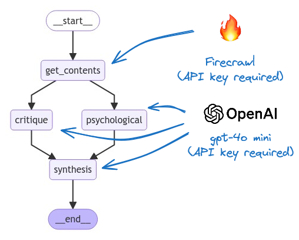

# My Daily Propaganda

## Table of Contents
- [Description](#description)
- [Technologies](#technologies)
- [Installation](#installation)
- [Usage](#usage)
- [Development](#development)
- [Design](#design)
- [Contributing](#contributing)
- [License](#license)

## Description
**My Daily Propaganda** is a press critique analysis tool developed by Brest Social Engines (BSE). It allows users to analyze and critique news articles through a powerful combination of Reflex and LangGraph technologies, using a social engine to facilitate the analysis of potential biases and propaganda techniques in the media.

The goal of this project is to provide an intuitive platform for users to critically engage with media content, enhancing their ability to recognize biased narratives and understand the mechanisms of propaganda in daily news.

## Technologies
- **Language**: Python
- **Frontend**: Reflex
- **Framework for LLM**: LangChain and LangGraph
- **Observability and Prompt Management Tool**: LangSmith
- **Dependency Management**: Poetry
- **Environment**: API keys configured in a `.env` file

## Installation
To install and configure My Daily Propaganda locally, follow these steps:

1. Clone the repository:
    ```bash
    git clone https://github.com/your-username/mydailyprop.git
    cd mydailyprop
    ```

2. Install the dependencies with Poetry:
    ```bash
    poetry install
    ```

3. Configure the API keys:
    - Copy the `.env.template` file to `.env`
    - Add your API keys to the `.env` file

## Usage
To run the project locally, proceed as follows:

1. Activate the Poetry environment:
    ```bash
    poetry shell
    ```

2. Run the project:
    ```bash
    reflex run
    ```

Access the user interface in your browser to start analyzing and critiquing news articles.

## Development
For developers wishing to contribute or work on advanced features, follow these additional steps:

1. Install the dependencies with the development tools:
    ```bash
    poetry install --with dev
    ```

2. It is recommended to use **Visual Studio Code (VSCode)** as the IDE. Install the **Run and Debug** extension to run the Reflex project directly from the editor.

3. You can choose to display the LangGraph graph depending on the configuration:
    - If you have installed the development tools with `poetry install --with dev`, you can run the project with the graph display.
    - Otherwise, the project can be run without this option.

## Design
Below is a visual representation of the system design for **My Daily Propaganda**:



## Contributing
Contributions are welcome! To propose changes, follow these steps:

1. Fork the project.
2. Create a branch for your feature (`git checkout -b feature/NewFeature`).
3. Commit your changes (`git commit -m 'Add a new feature'`).
4. Push your branch (`git push origin feature/NewFeature`).
5. Open a Pull Request.

## License
This project is licensed under the Apache 2.0 License. See the [LICENSE](LICENSE) file for details.
